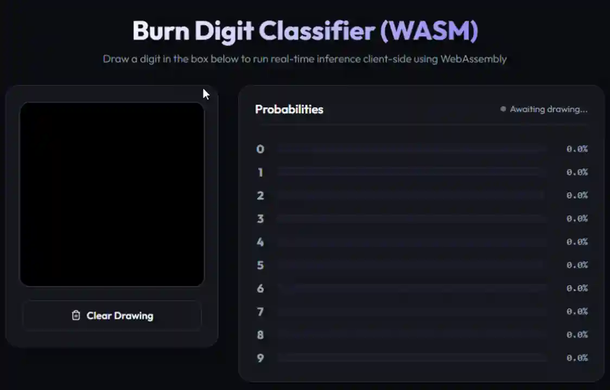

# 🔢 MNIST, EMNIST & Quick, Draw! Classifier — Burn (Rust)

> An interactive handwritten digit, letter, and doodle classifier built with the [Burn](https://burn.dev/) deep learning framework in Rust. Train a CNN model, run inference from the CLI, or draw in the browser!
>
> 🚀 **[Try the Live WebAssembly Demo!](https://magikerwin.github.io/rust-drawing-classifier-web/)**



---

## 📑 Table of Contents

- [Features](#-features)
- [Model Architecture](#️-model-architecture)
- [Project Structure](#-project-structure)
- [Getting Started](#-getting-started)
  - [Train the Model](#train-the-model)
  - [Run Tests](#run-tests)
  - [CLI Inference](#cli-inference)
  - [Interactive Web Server (Axum)](#interactive-web-server-axum-backend)
  - [Client-Side WebAssembly App](#client-side-webassembly-app-wasm)
- [Quick, Draw! Classification Details](#-quick-draw-classification-details)
- [References](#-references)
- [License](#-license)

---

## ✨ Features

- **MobileNet-style CNN Architecture** — Depthwise Separable Convolutions, 1x1 projection and identity residual shortcuts, BatchNorm, GAP, and Dropout
- **Interactive Web Demo** — Draw on a canvas and get real-time predictions
- **WebAssembly Client-Side Inference** — Runs entirely in the browser via WASM, no backend required
- **CLI Inference** — Predict with ASCII art visualization
- **Fully in Rust** — Training, inference, and web frontend in a unified workspace
- **Data Augmentations** — Random spatial translation, scale/zoom shifts, and horizontal flips (QuickDraw) applied dynamically during batch collation for robust canvas prediction

---

## 🏗️ Model Architecture

```
Input [1×28×28]
  → Stem: Conv2d(1→24, 3×3, stride=1) → BatchNorm → ReLU                 → [24×28×28]
  → Block 1: SeparableConv(24→48, stride=2) + Proj Shortcut(24→48)
             → BatchNorm → ReLU                                          → [48×14×14]
  → Block 2: SeparableConv(48→96, stride=2) + Proj Shortcut(48→96)
             → BatchNorm → ReLU                                          → [96×7×7]
  → Block 3: SeparableConv(96→96, stride=1) + Identity Shortcut
             → BatchNorm → ReLU                                          → [96×7×7]
  → Classifier:
      → Global Average Pooling (GAP)                                     → [96×1×1]
      → Flatten                                                          → [96]
      → Dropout(0.5)
      → Linear(96→num_classes)
```

---

## 📁 Project Structure

```
rust-drawing-classifier-web/
├── model_shared/           # Shared library workspace crate
│   └── src/lib.rs          # CNN model definition & LayerNorm layers
├── web/                    # Rust WASM crate (wasm-pack entry point)
├── src/                    # Training & CLI inference (Burn backend)
│   ├── main.rs
│   ├── model.rs            # Re-exports shared model definition
│   ├── training.rs
│   └── ...
├── docs/                   # Static web frontend (served by GitHub Pages)
│   ├── index.html          # Single-page drawing app with Developer Console
│   └── pkg/                # Compiled WASM output (gitignored, built by CI)
├── assets/                 # README images and training curves
├── build.rs                # Copies model weights at build time
├── publish-weights.ps1     # Helper script to upload weights to GitHub Releases
└── .github/workflows/
    └── deploy.yml          # CI: build WASM → assert → deploy → verify
```


> **Git Branches:**
> - `master` — The only branch you need. All development happens here. Compiled binaries are gitignored and built fresh by CI on every deploy.

---


## 🚀 Getting Started

### Train the Model

By default, training runs on the CPU (`NdArray` backend):

```sh
cargo run --release
```

To train on your GPU (`Wgpu` backend):

```sh
cargo run --release -- --gpu
```

To train on the **EMNIST Letters** dataset (26 classes, downloads dynamically):

```sh
# CPU
cargo run --release -- --dataset emnist

# GPU
cargo run --release -- --dataset emnist --gpu
```

To train on the Google **Quick, Draw!** dataset (25 classes, downloads dynamically):

```sh
# CPU
cargo run --release -- --dataset quickdraw

# GPU
cargo run --release -- --dataset quickdraw --gpu
```

> **Dataset Cache:** Dataset files are downloaded once and cached at `target/emnist_dataset/` and `target/quickdraw_dataset/`. If you change the configurations, delete the caches first so they re-download:
> ```sh
> rm -rf target/quickdraw_dataset   # Linux / macOS
> Remove-Item -Recurse -Force target\quickdraw_dataset  # Windows PowerShell
> ```

> **Note:** Always use `--release` for optimized tensor math performance.


#### 📊 Results

After 5 epochs of training:

| Dataset | Validation Accuracy | Validation Loss |
|---|---|---|
| **MNIST** (10 classes) | `~98%+` | `~0.05` |
| **EMNIST Letters** (26 classes) | `~84%+` | `~0.49` |
| **Quick, Draw!** (25 classes) | `~86%+` | `~0.51` |


<details>
<summary>📈 View MNIST Training Progress Curve</summary>


</details>

---

### Run Tests

```sh
cargo test
```

---

### CLI Inference

Once trained, predict from the MNIST test set:

```sh
cargo run --release -- --predict
```

Predict from the EMNIST Letters test set:

```sh
cargo run --release -- --predict --dataset emnist
```

Predict from the Quick, Draw! test set:

```sh
cargo run --release -- --predict --dataset quickdraw
```

<details>
<summary>📝 Example Output (MNIST)</summary>

```text
Loading model for inference...

Input Image:
      ######                
      ################      
      ################      
           ###########      
                  ####      
                 ####       
                 ####       
                ####        
                ####        
               ####         
               ###          
              ####          
             ####           
            #####           
            ####            
           #####            
           ####             
          #####             
          #####             
          ####              
                            
Target Label (Ground Truth): 7
Top Predictions:
  1. 7            : 99.42%
  2. 9            : 0.35%
  3. 2            : 0.11%
```

</details>

<details>
<summary>📝 Example Output (EMNIST Letters)</summary>

```text
Loading model for inference (dataset: emnist)...
Loading and parsing EMNIST Letters test data...

Input Image:


           ...
         .#####
      ..######.
     ..#######.
    .########....
   .######...####.
   .#####...#####.
   ###############
  .###############
   .##############.
   .###############.
    ..####..   .####..
      ....     .######..
       ..       ...####..
                   ......


Target Label (Ground Truth): A
Top Predictions:
  1. A            : 88.57%
  2. R            : 3.80%
  3. D            : 1.84%
```

</details>

<details>
<summary>📝 Example Output (Quick, Draw!)</summary>

```text
Loading model for inference (dataset: quickdraw)...

Input Image:
         #          
        ###         
       #####        
      #######       
     #########      
    ###########     
   #############    
  ###############   
 #################  

Target Label (Ground Truth): triangle
Top Predictions:
  1. triangle     : 96.81%
  2. mountain     : 2.14%
  3. house        : 0.45%
```

</details>

---

### Interactive Web Server (Axum backend)

Start the browser-based drawing pad backed by the Rust Axum server:

- **MNIST Digits (default)**:
  ```sh
  cargo run --release -- --serve
  ```
  Open **[http://127.0.0.1:3000](http://127.0.0.1:3000)** to draw digits (0–9).

- **Quick, Draw! Doodles**:
  ```sh
  cargo run --release -- --serve --dataset quickdraw
  ```
  Open **[http://127.0.0.1:3000](http://127.0.0.1:3000)** to draw and predict doodles (25 classes).

---

### Client-Side WebAssembly App (WASM)

The trained models compile to WebAssembly for fully client-side inference. Model weights are **decoupled from Git history** to avoid binary bloat:
- **Locally**: `build.rs` copies fresh weights from `target/` at compile time.
- **In CI**: `build.rs` downloads stable weights from GitHub Releases via `curl`.

#### 1. Build the WASM bundle locally

Make sure you have trained the models first, then:

1. **Install wasm-pack**:
   ```sh
   cargo install wasm-pack
   ```

2. **Build the WebAssembly module**:
   * **Using the helper binary (Recommended, cross-platform)**:
     ```sh
     cargo run --bin build_web
     ```
   * **Or run the command manually** (does not automatically clean up duplicate/redundant folders):
     ```sh
     wasm-pack build web --target web --out-dir ../docs/pkg
     ```

3. **Install a local static file server** (needed for the preview):
   ```sh
   cargo install basic-http-server
   ```

4. **Serve locally**:
   ```sh
   basic-http-server docs
   ```
   Navigate to **[http://localhost:4000](http://localhost:4000)**.

#### 2. Automatic Deployments & Release Management

The CI workflow (`.github/workflows/deploy.yml`) automatically builds and deploys to GitHub Pages on every push to `master`. It also verifies the live WASM URL after deploying.

To update the model weights used by the CI runner:

1. Ensure the GitHub CLI (`gh`) is installed and authenticated:
   - **Install** (Windows): `winget install --id GitHub.cli` (restart VS Code after)
   - **Authenticate**: `gh auth login` → GitHub.com → HTTPS → browser

2. Upload your local weights to a GitHub Release:
   ```sh
   # Default v1.0.0
   cargo run --bin publish_weights

   # Custom version tag
   cargo run --bin publish_weights -- v2.0.0
   ```

   The script now updates [web/weights-version.txt](web/weights-version.txt) and [docs/weights-version.txt](docs/weights-version.txt) automatically, so you no longer need to edit those files by hand.

3. Commit and push the updated version files along with any code changes:
   ```sh
   git add web/weights-version.txt docs/weights-version.txt
   git commit -m "Update model weights version"
   git push origin master
   ```

4. Trigger the deployment:
   - **Code changes**: `git push origin master`
   - **Weights only**: Go to **Actions → Deploy WebAssembly to GitHub Pages → Run workflow**

5. Verify your repository settings under **Settings → Pages → Build and deployment**:
   - **Source**: `GitHub Actions`

   > ℹ️ The workflow uses the official GitHub Pages API (`upload-pages-artifact` + `deploy-pages`), so no `gh-pages` branch is needed.

---

## 🎨 Quick, Draw! Classification Details

This project supports doodle classification using the public Google **[Quick, Draw! Dataset](https://github.com/googlecreativelab/quickdraw-dataset)**.

### Selected Categories (25 classes)

Rather than training on all 345 categories (39 GB of raw data), we train on a curated subset of **25 diverse and sketchable classes**:

| Group | Classes |
|---|---|
| Nature / Weather | `sun`, `moon`, `star`, `tree`, `flower` |
| Animals | `cat`, `dog`, `fish`, `butterfly` |
| Common Objects | `cup`, `key`, `umbrella`, `hat`, `clock`, `envelope`, `toothbrush` |
| Structures / Vehicles | `house`, `car` |
| Shapes | `circle`, `triangle`, `square`, `smiley face` |
| Clothing | `pants`, `t-shirt` |
| Food | `apple` |

### Key Design Considerations

1. **Compute & Storage**: 25 classes → ~250 MB footprint, fits in memory, trains in minutes on a consumer GPU.
2. **Model Capacity**: A simple CNN easily achieves high accuracy on 25 distinct shapes vs. struggling with all 345.
3. **Canvas Drawability**: These shapes are simple and iconic enough to draw clearly on a `28×28` canvas.
4. **License & Privacy**: CC BY 4.0, no personally identifiable information (PII).

---

## 📚 References

- [Burn — Deep Learning Framework for Rust](https://burn.dev/)
- [The Burn Book](https://burn.dev/book/)
- [tracel-ai/burn MNIST example](https://github.com/tracel-ai/burn/blob/main/examples/mnist/examples/mnist.rs)
- [Google Quick, Draw! Dataset](https://github.com/googlecreativelab/quickdraw-dataset)
- [wasm-pack — Rust WebAssembly Packager](https://rustwasm.github.io/wasm-pack/)
- [Yann LeCun's MNIST Database](https://yann.lecun.com/exdb/mnist/)

---

## 📄 License

This project is licensed under the [MIT License](./LICENSE).
